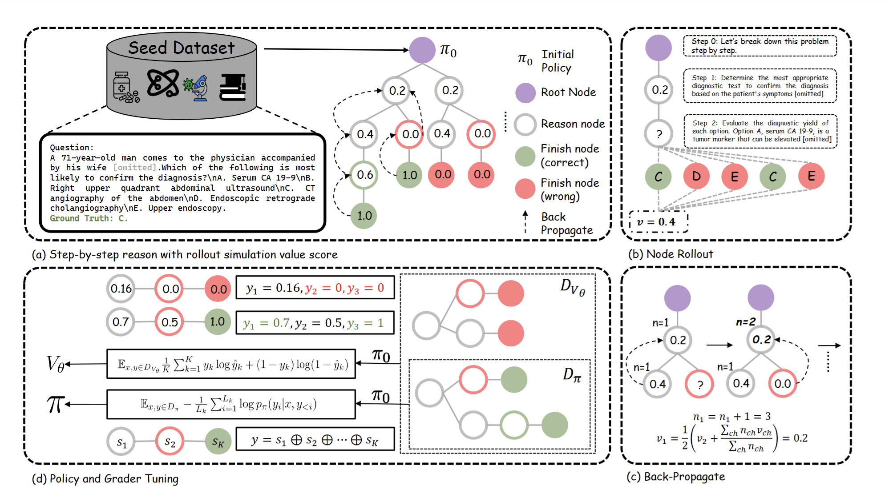

# MedSSS

<p align="center">
📃 <a href="http://arxiv.org/abs/2501.12051" target="_blank">Paper</a> ｜🤗 <a href="https://huggingface.co/pixas/MedSSS_Policy" target="_blank">MedSSS-8B-Policy</a> ｜🤗 <a href="https://huggingface.co/pixas/MedSSS_PRM" target="_blank">MedSSS-8B-PRM</a> | 📚 <a href="https://huggingface.co/datasets/pixas/MedSSS-data" target="_blank">SFT/PRM Data</a>
</p>


## ⚡Introduction
This repository contains the self-evolving pipeline of MedS$^3$, a slow-thinking small medical language models built with a self-evolution pipeline.

<div align=center>

</div>


**MedS$^3$** is a medical LLM designed for advanced medical reasoning. It can leverage the PRM model to select the most correct response from several outputs. It supports both traditional medical question answering problems, as well as realistic clinical problems.
It is built with the following three steps

- Using Monte-Carlo Tree Search to self-collect correct and incorrect reasoning trajectories.
- Use SFT to train a policy model in the correct trajectory set and use soft-label two-class classification to train a PRM model in both correct/incorrect internal reasoning steps.
- Use PRM-Vote-Sum decoding method to generate several candidate responses and use PRM to select the most appropriate one.

We open-sourced our models, data, and code here.


## 👨‍⚕️ Model
- **Model Access**

|                      | Backbone     | Supported Languages | Link                                                                  |
| -------------------- | ------------ | ----- | --------------------------------------------------------------------- |
| **MedSSS-8B-Policy**  | LLaMA-3.1-8B  | English    | [HF Link](https://huggingface.co/pixas/MedSSS_Policy) |
| **MedSSS-8B-PRM**  | LLaMA-3.1-8B  | English    | [HF Link](https://huggingface.co/pixas/MedSSS_PRM) |

- **Deploy**

As the policy model and the PRM model are both LoRA adapters, you can deploy them with the same backbone `meta-llama/Llama-3.1-8B-Instruct`.
Specifically, for policy model:

```python
from transformers import AutoModelForCausalLM, AutoTokenizer
from peft import PeftModel
base_model = AutoModelForCausalLM.from_pretrained("meta-llama/Llama-3.1-8B-Instruct",torch_dtype="auto",device_map="auto")
model = PeftModel.from_pretrained(base_model, "pixas/MedSSS_Policy", torc_dtype="auto", device_map="auto")
tokenizer = AutoTokenizer.from_pretrained("pixas/MedSSS_Policy")
input_text = "How to stop a cough?"
messages = [{"role": "user", "content": input_text}]
inputs = tokenizer(tokenizer.apply_chat_template(messages, tokenize=False,add_generation_prompt=True
), return_tensors="pt").to(model.device)
outputs = model.generate(**inputs, max_new_tokens=2048)
print(tokenizer.decode(outputs[0], skip_special_tokens=True))
```

For PRM Model:
```python
from transformers import AutoModelForTokenClassification, AutoTokenizer
from peft import PeftModel
base_model = AutoModelForTokenClassification.from_pretrained("meta-llama/Llama-3.1-8B-Instruct",torch_dtype="auto",device_map="auto")
model = PeftModel.from_pretrained(base_model, "pixas/MedSSS_PRM", torc_dtype="auto", device_map="auto")
tokenizer = AutoTokenizer.from_pretrained("pixas/MedSSS_PRM")
steps
input_text = "How to stop a cough?"
step_wise_generation = "Step 0: Let's break down this problem step by step.\n\nStep 1: First [omitted]"

value = obtain_prm_value_for_single_pair(tokenizer, model, input_text, step_wise_generation)
print(value)
```


## 📚 Data
- **Data Access**

You can access the detailed step-by-step solution in [HF link](https://huggingface.co/datasets/pixas/MedSSS-data).

## 🚀 Self-Evolve Pipeline
For automatic generation of data, fine-tuning of policy and PRM and evaluation, we integrate them to `scripts/iter_run_mcts_mixdata_prm.sh`.
The only think you need to do is to change `BASE_PATH` and `TASK_PATH` to your actual paths in Line9 and Line12. 


Remember to change the corresponding paths in the three scripts under the `scripts/eval/` folder as well as `scripts/train/sft_lora_r16_iter.sh`.


## 🧐 Only Evaluation
If we want to directly evaluate MedS$^3$ in the downstream tasks, you can run the following script:
```bash
sbatch scripts/slurm/generate_parallel_peft_batch_med.sh $task_path $model_base $model_path medsss $logs_path $dataset scvm 16 1 0 None None None "${model_path} ${prm_path}" prm-min-vote-sum 
```
where 
- `task_path`: the parent dir of the evlauation file, which can be directly set to `evaluation_data`
- `model_base`: `meta-llama/Llama-3.1-8B-Instruct`
- `model_path`: the local folder of `pixas/MedSSS_Policy`
- `logs_path`: the log dir of this evaluation
- `dataset`: one of the 11 datasets, which can refer to `domains=("MedQA_cot" "medsins_task16" "medsins_task29" "medsins_task130" "medsins_task131" "MedMCQA_cot" "med_mmlu_cot" "pubmedqa_c_cot" "bioasq" "pubhealth" "biomrc")`
- `prm_path`: the local folder of `pixas/MedSSS_PRM`

After completing the whole generation, you can refer to `logs_path/result.json` to see the final accuracy measured in exact match.
